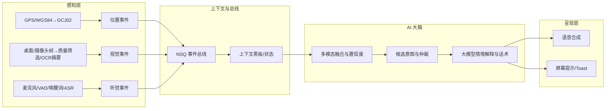

# RobotChatAny：下一代主动智能聊天机器人

> 主动式多模态 AI 助手：拥有"视觉 + 听觉 + 会说话"的能力，让AI在正确的时刻，用正确的方式主动帮助你。

**最新版本**: v1.0.0 | **代码规模**: 306 Go 文件 + 12 Kotlin 文件 | **最后更新**: 2026-06-01

---

## 📋 项目简介

RobotChatAny 是一款面向个人与开发者的**主动式多模态 AI 智能助手系统**。它具备视觉（屏幕/摄像头）、听觉（麦克风，VAD/唤醒词/ASR）与会说话（TTS）的能力，结合位置（GPS→高德逆地理/天气/路况）与历史上下文，在不打扰你的前提下，主动提供有用的信息与建议。我们支持对接手表、手机等设备，融合健康/运动/睡眠数据，打造真正"懂你"的AI伙伴。

### 核心特性

- **主动对话与情境理解**: AI 基于时间/地点/视觉/听觉/历史对话主动发起交流
- **多模态感知**: 桌面/摄像头视觉、麦克风 VAD/唤醒词/ASR、TTS 多情绪输出
- **AI 大脑与上下文黑板**: WorldState 统一融合多模态置信度后决策
- **位置与环境融合**: GPS（WGS84→GCJ02）、高德逆地理/天气/路况、围栏/停留检测
- **可扩展架构**: 插件化工具生态（100+ 工具）+ NSQ 事件总线 + 异步处理
- **隐私优先**: 相机/麦克风/位置独立开关，一键暂停；位置默认 geohash 模糊化
- **高性能技术栈**: Golang 1.24 + xorm + TCP 长连接 + PostgreSQL + Redis 集群

---

## 🏗️ 技术架构

### 后端技术栈

| 类别 | 技术选型 | 版本 | 说明 |
|------|---------|------|------|
| **编程语言** | Go | 1.24.0 | 最新稳定版，toolchain go1.24.7 |
| **Web 框架** | Gin | v1.10.0 | HTTP REST API |
| **AI Agent 框架** | CloudWeGo Eino | v0.5.0 | 字节跳动开源 Agent 框架 |
| **LLM** | 通义千问 qwen-turbo | - | 阿里云 DashScope |
| **ORM** | XORM | v1.3.9 | PostgreSQL 数据库操作 |
| **数据库** | PostgreSQL | - | 关系型数据存储 |
| **缓存** | Redis + BigCache | v9.8.0 / v3.1.0 | 双层缓存架构 |
| **消息队列** | NSQ + Kafka | v1.1.0 / v0.4.48 | 异步消息处理 |
| **对象存储** | 华为云 OBS / MinIO | v3.25.4 / v7.0.94 | 文件存储 |
| **日志** | Zap | v1.27.0 | 结构化日志 |
| **认证** | JWT | v5.2.2 | Token 认证 |
| **向量数据库** | Qdrant | - | RAG 向量检索 |
| **Embedding** | Infinity | - | Alibaba-NLP/gte-multilingual-base, 768维 |

### 前端/移动端

| 平台 | 技术栈 | 说明 |
|------|--------|------|
| **Android** | Kotlin + Jetpack | Room 数据库、协程、Fragment 导航 |
| **Web API** | RESTful + JWT | Gin 框架，CORS 中间件 |

---

## 🔧 核心模块

### 1. Brain 大脑系统 (20 个文件)
**路径**: `internal/brain/`

**职责**: AI 决策中枢，维护世界状态，预测用户行为

**核心组件**:
- `service.go`: Brain 主服务，管理 WorldState
- `prediction_engine.go`: 智能预测引擎（健康/工作/生活需求预测，RAG 增强）
- `action_executor.go`: 动作执行器（自动执行高优先级建议）
- `learning_engine.go`: 学习引擎（从交互中学习用户偏好）
- `evolution_engine.go`: 进化引擎（持续优化系统能力）
- `knowledge_base.go`: 知识库管理
- `gps_service.go`: GPS 定位服务（条件触发优化）

### 2. Tools 工具生态系统 (100+ 工具)
**路径**: `internal/tools/`

**架构**: 统一注册中心模式，按领域分类

| 分类 | 核心功能 |
|------|----------|
| **health/** | 健康追踪、饮食管理、智能提醒 |
| **personal/** | 日历管理、待办管理、时间管理 |
| **analysis/** | 文件处理、数据分析、报告生成 |
| **intelligence/** | 知识图谱、推理引擎、情感分析、推荐系统、行为预测 |
| **utility/** | 代码执行、翻译、单位转换、计算器、时区转换 |
| **communication/** | 邮件管理、通知管理 |
| **multimedia/** | 图像处理、音频处理、OCR |
| **security/** | 安全管理、加密管理 |
| **finance/** | 财务管理、预算管理 |
| **automation/** | 工作流管理、调度管理 |
| **cloud/** | 云存储管理、API 集成 |
| **social/** | 社交媒体管理、内容发布 |
| **mobile/** | 移动适配、推送通知 |
| **visualization/** | 数据可视化 |
| **smart_schedule/** | 智能日程 |
| **voice/** | 语音转文字 |
| **work/** | 工作助手 |

### 3. Intelligent Assistant 智能助手层
**路径**: `internal/intelligent/`

**Agent 工作流程**:
```
用户输入 → IntentRecognizer (意图识别) → ToolCoordinator (工具协调规划)
       → Tool Execution (工具链执行) → Response Generation (回复生成)
       → ContextMemory (上下文记忆更新) → PreferenceLearner (偏好学习)
```

### 4. RAG 检索增强生成
**路径**: `pkg/rag/`

**完整流程**:
```
文档 → Embedding (Infinity, 768维) → Qdrant 向量存储
    → 语义搜索 (TopK=5) → 返回相关文档增强 Prompt
```

### 5. TCP 通信协议
**路径**: `internal/tcp/`, `internal/protocol/`

**特性**:
- 自定义二进制协议
- 心跳保活（30 秒间隔，90 秒超时）
- 安全编解码（AES 加密）
- 最大连接数: 10,000
- TLS 支持（可配置）

---

## 💾 数据存储架构

### PostgreSQL
- **主机**: 101.126.17.221:25432
- **数据库**: robot_any
- **连接池**: MaxIdle=10, MaxOpen=100
- **表同步**: xorm.Sync2 自动建表

### Redis 集群
- **实例1** (DB 0): 用户数据缓存
- **实例2** (DB 1): 业务数据缓存
- **实例3** (DB 2): 会话缓存
- **降级策略**: 可选本地缓存（MB级）

### 向量数据库 Qdrant
- **地址**: 107.149.143.39:36333
- **集合**: my_brain
- **维度**: 768
- **TopK**: 5

---

## 🚀 快速开始

### 前置要求

- Go 1.24+
- PostgreSQL 12+
- Redis 6+
- （可选）NSQ、MinIO/华为云OBS

### 安装步骤

1. **克隆仓库**
```bash
git clone https://github.com/yourusername/new-robot-self.git
cd new-robot-self
```

2. **安装依赖**
```bash
go mod download
```

3. **配置服务**

编辑 `config.yaml`，配置以下服务：

```yaml
# AI 服务配置
ai:
  api_key: "YOUR_API_KEY"
  endpoint: "https://dashscope.aliyuncs.com/api/v1/services/aigc/text-generation/generation"
  model: "qwen-turbo"

# 数据库配置
postgres:
  host: your_host
  port: 5432
  user: your_user
  password: your_password
  dbname: robot_any

# Redis 配置
redis:
  host: your_host
  port: 6379
  password: your_password
  db: 0

# Web 服务配置
web:
  port: 28091

# TCP 服务配置
tcp:
  port: 29088
```

4. **初始化数据库**

程序启动时会自动同步表结构，无需手动建表。

5. **启动服务**
```bash
go run cmd/main.go
```

6. **验证服务**

访问健康检查接口：
```bash
curl http://localhost:28091/ping
```

---

## 📱 Android 客户端

**路径**: `android-app/`

**技术栈**: Kotlin + Jetpack (Room、协程、Fragment)

**功能模块**:
- 聊天界面
- 任务列表
- 个人资料
- 底部三标签导航

**当前状态**: 基础框架完成，展示 GPS 数据（10 秒刷新）

**构建方式**:
```bash
cd android-app
./gradlew build
```

---

## 📊 项目计划以及完成度

### 总体目标
打造具备"视觉 + 听觉 + 会说话"的主动式多模态 AI 助手。各感知模块以时间戳为统一时序，服务于 AI 大脑的情景分析与推理；通过 NSQ 事件总线与插件化架构实现可扩展生态。

### 路线图（Roadmap）

#### ✅ 阶段1·基础架构（已完成 100%）
- TCP长连接、认证、心跳与连接管理器，安全编解码与协议栈
- 配置、日志、缓存、数据库与资源加载

#### ✅ 阶段2·AI对话与权重系统（已完成 85%）
- CloudWeGo Eino 框架集成
- 100+ 工具生态系统
- 意图识别与工具协调
- 预测引擎与置信度机制

#### ✅ 阶段3·情境感知（视觉）（已完成 60%）
- 截图服务与压缩
- 本地图片质量筛选（清晰度/对比度/均匀度/aHash去重）
- 待接入云端多模态视觉分析

#### ⏳ 阶段4·听觉与语音闭环（进行中 10%）
- voice 工具占位
- 待集成 VAD/唤醒词 → ASR → LLM → TTS 首版闭环

#### ✅ 阶段5·位置与环境融合（已完成 90%）
- GPS（WGS84→GCJ02）
- 高德逆地理/天气/路况/周边搜索
- Awareness 层内存 TTL 缓存 + 重试机制
- Brain 层 GPSService 条件触发优化

#### ⏳ 阶段6·产品化与生态（规划中）
- 监控告警（Grafana/Prometheus）
- A/B 调参平台
- 权限与合规完善

### 里程碑与完成度

| 里程碑 | 完成度 | 说明 |
|--------|--------|------|
| **M1 基础通信稳定上线** | ✅ 100% | 长连接、认证、心跳与协议、安全编解码 |
| **M2 上下文与Prompt框架** | ✅ 100% | 上下文结构、生成器与优化策略 |
| **M3 视觉链路与质量筛选** | ✅ 80% | 截图服务与质量评估器完成，服务侧接入进行中 |
| **M4 语音闭环 MVP** | ⏳ 10% | voice 工具占位，待集成 VAD/ASR/TTS |
| **M5 位置/天气/路况融合** | ✅ 90% | 高德全套 API、缓存优化、条件触发已完成 |
| **M6 权重系统实装** | ✅ 70% | 预测引擎、置信度、优先级已实现 |

---

## 🎯 总体架构



---

## 🔍 目录结构

```
new-robot-self/
├── cmd/                    # 程序入口
│   ├── main.go            # 主程序
│   └── test/              # 测试与演示程序 (50+ 文件)
├── api/                   # API 接口定义
├── router/                # 路由配置
├── service/               # 业务服务层
├── model/                 # 数据模型
├── middleware/            # 中间件
├── webHandler/            # Web 控制器
├── internal/              # 核心业务逻辑
│   ├── brain/            # AI 大脑 (20 文件)
│   ├── tools/            # 工具生态 (100+ 工具)
│   ├── intelligent/      # 智能助手层
│   ├── awareness/        # 环境感知
│   ├── ai/               # AI 服务
│   ├── context/          # 上下文管理
│   ├── prompt/           # Prompt 生成
│   ├── trigger/          # 触发器
│   ├── connection/       # 连接管理
│   ├── protocol/         # 通信协议
│   ├── tcp/              # TCP 服务器
│   ├── queue/            # 消息队列
│   ├── nsq/              # NSQ 消费者
│   ├── push/             # 推送服务
│   └── resource/         # 资源管理
├── pkg/                   # 公共工具包
│   ├── rag/              # RAG 服务
│   ├── location/         # 位置服务
│   ├── cache/            # 缓存抽象
│   ├── screenshot/       # 截图服务
│   ├── upload/           # 文件上传
│   ├── logger/           # 日志封装
│   ├── postgres/         # PostgreSQL 封装
│   └── ...
├── initialize/            # 初始化模块 (18 步)
├── config/                # 配置模块
├── public/                # 公开接口
├── global/                # 全局变量
├── android-app/           # Android 客户端
├── doc/                   # 设计文档
├── asset/                 # 静态资源
├── logs/                  # 日志文件
├── config.yaml            # 配置文件
├── go.mod                 # Go 模块依赖
└── Readme.md              # 项目说明
```

---

## 📝 隐私与合规

- **明示授权与可见指示**: 位置/麦克风/摄像头各自独立开关，可一键暂停
- **数据最小化与本地优先**: 默认仅上传必要元数据；位置默认 geohash 模糊化，门牌级需授权
- **加密与访问控制**: 传输 TLS，存储分级加密；最小权限与访问审计；敏感数据 TTL
- **供应商合规**: 遵循高德/云服务条款与本地隐私法规，不做反向解析或越权存储

---

## 🤝 加入我们

无论你是后端高手、AI算法爱好者、产品设计师还是热衷体验的普通用户，都欢迎加入RobotChatAny！一起探索主动智能的无限可能。

- 参与核心功能开发，体验高性能Golang后端实践
- 设计和实现有趣的AI插件，扩展无限应用场景
- 共建健康数据、主动对话、情感计算等创新模块
- 贡献文档、测试、社区支持，共同打造开源生态

> 让AI不再冷冰冰，让陪伴触手可及。

---

## 📞 联系方式

- **QQ**: 1321291309
- **GitHub Issues**: 提交问题与建议
- **Pull Requests**: 欢迎贡献代码


---

## 📚 相关文档

- [项目概览 2026Q2](doc/项目概览_2026Q2.md) - 最新项目信息
- [技术设计文档](doc/technical_design.md)
- [TCP 协议设计](doc/tcp_design.md)
- [AI 对话设计](doc/ai_chat_design.md)
- [上下文管理设计](doc/context_management_design.md)
- [位置模块设计](doc/location_step1_design.md)
- [主动触发策略](doc/主动触发策略_v1.0.md)
- [产品愿景](doc/产品愿景_分离式智能助理_v1.0.md)

---

**许可证**: 详见 LICENSE 文件

**最后更新**: 2026-06-01
